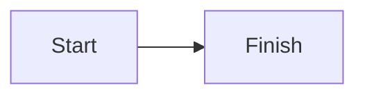

# nice-mermaid.nvim

Render Mermaid diagrams as Unicode terminal art inside Neovim. Diagrams open in a read-only Markdown preview. Run `:Mermaid` to switch back to source.


## Requirements

- Neovim 0.10 or newer
- Node 18 or newer

## Install with Lazy.nvim

```lua
{
  "iurysza/nice-mermaid.nvim",
  ft = { "markdown" },
  cmd = { "Mermaid" },
  build = function(plugin)
    local result = vim.system({ "npm", "ci", "--omit=dev" }, {
      cwd = plugin.dir .. "/bridge",
      text = true,
    }):wait()
    if result.code ~= 0 then
      error(result.stderr)
    end
  end,
  opts = {},
  keys = {
    { "<leader>mm", "<cmd>Mermaid toggle<cr>", desc = "Toggle Mermaid source" },
  },
}
```

## Use it

Open a Markdown buffer with a fenced Mermaid block. The rendered view opens automatically.

````markdown

````

Run `:Mermaid` to switch between the preview and source. Unsaved edits stay in the source buffer. Run `:checkhealth nice_mermaid` if rendering fails. Contributors can start with [the knowledge base](ai-artifacts/_index.md).

## Configure

```lua
require("nice_mermaid").setup({
  auto_render = true,
  filetypes = { "markdown", "markdown.mdx" },
  node = "node",
})
```

## Markdown rendering

Mermaid diagrams render without another Markdown plugin. To render headings, links, tables, and lists, add `mermaid-preview` to [`render-markdown.nvim`](https://github.com/MeanderingProgrammer/render-markdown.nvim)'s filetypes:

```lua
{
  "MeanderingProgrammer/render-markdown.nvim",
  ft = { "markdown", "mermaid-preview" },
  opts = {
    overrides = {
      filetype = {
        ["mermaid-preview"] = {
          anti_conceal = { enabled = false },
          win_options = {
            concealcursor = { default = "nvic", rendered = "nvic" },
          },
        },
      },
    },
  },
}
```

## Supported diagrams

`grok-mermaid` renders flowcharts, sequence diagrams, state diagrams, class diagrams, and entity relationship diagrams. Invalid or unsupported diagrams remain as source text.

## Development

```sh
npm ci --prefix bridge --omit=dev
make test
make format-check
```

The Lua tests run against Neovim. The renderer contract test runs against Node.

## License

`nice-mermaid.nvim` uses the [MIT License](LICENSE). `grok-mermaid` uses the Apache-2.0 license.

`nice-mermaid.nvim` uses [`grok-mermaid`](https://www.npmjs.com/package/grok-mermaid), a JavaScript library, to produce Unicode diagrams. Neovim cannot import it directly, so [`bridge/render.mjs`](bridge/render.mjs) passes JSON between Neovim and Node. Lazy.nvim installs the pinned package during the plugin build. Rendering never installs packages.
