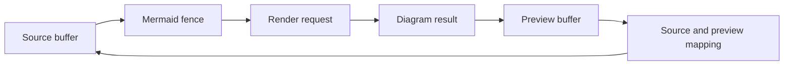

# Rendering context

`nice-mermaid.nvim` turns Mermaid fences in editable Markdown into a read-only terminal-art view. This glossary fixes the terms used in contributor documentation and reviews.

## Model

## Language

**Source buffer**:
The editable Markdown buffer that owns the document text. It remains the source of truth, including unsaved edits.

_Avoid_: original buffer, input buffer, document buffer

**Mermaid fence**:
A complete fenced code block whose first info-string word is `mermaid`, ignoring case. An incomplete fence is source text, not a Mermaid fence.

_Avoid_: Mermaid block when the fence may be incomplete, code block

**Render request**:
One batch containing every Mermaid fence from one source buffer at one source revision. The request crosses the Node bridge and produces one whole-batch response.

_Avoid_: diagram request when the batch may contain several diagrams, live render

**Diagram result**:
The bridge result for one Mermaid fence. A result is either styled rows for a rendered diagram or `false` for a fence that remains source text in the preview.

_Avoid_: preview result, rendered source

**Preview buffer**:
The read-only scratch buffer built from a source buffer and its accepted diagram results. It is a view of the source, not a second editable document.

_Avoid_: rendered source, output buffer, replacement buffer

**Projection**:
The preview text, extmarks, and row maps created from the source buffer and diagram results. Projection replaces only successfully rendered Mermaid fences.

_Avoid_: conversion, mutation of the source

**Source and preview mapping**:
The two row maps that preserve a nearby cursor and viewport position when windows switch between source and preview. A Mermaid fence maps to the first row of its rendered diagram.

_Avoid_: cursor state, line-number cache

**Stale result**:
A bridge response that no longer matches the source buffer, its revision, or its requested view. The plugin discards it without changing the editor state.

_Avoid_: cancelled render, failed render

**Bridge**:
The short-lived Node process at `bridge/render.mjs`. It reads a JSON array of Mermaid sources from standard input and writes one JSON array of diagram results to standard output.

_Avoid_: renderer, persistent service, daemon

**Renderer**:
The pinned `grok-mermaid` package that parses Mermaid source and creates styled Unicode rows. It does not own Neovim buffers or windows.

_Avoid_: bridge, preview

**Unsupported fence**:
A Mermaid fence for which `grok-mermaid` returns no styled result. The preview keeps that fence as source text, so one unsupported diagram does not prevent other diagrams in the same buffer from rendering.

_Avoid_: bridge failure, invalid preview

**Render failure**:
A failed bridge process or a bridge response that fails Lua validation. The plugin warns and does not accept the batch as a new preview.

_Avoid_: unsupported fence, stale result
