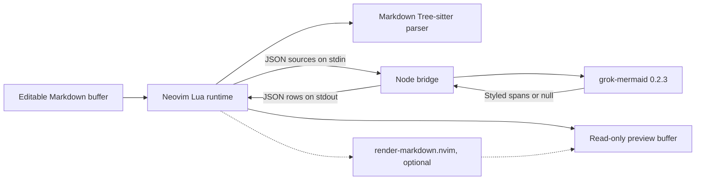
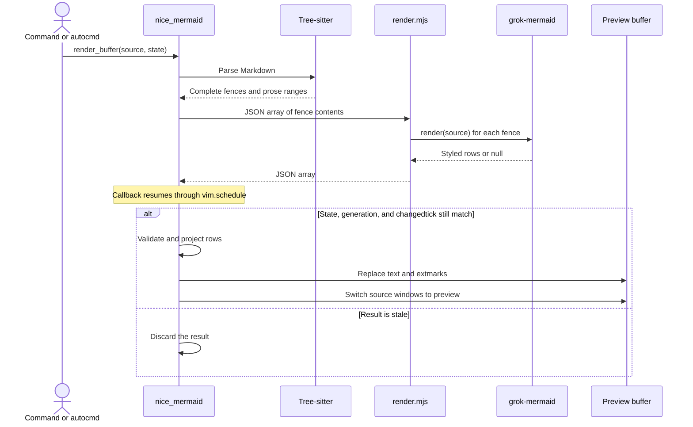

# How nice-mermaid.nvim renders Markdown

`nice-mermaid.nvim` keeps the editable Markdown buffer as the source of truth. It parses complete Mermaid fences in Neovim, sends their contents to a Node process, and builds a separate read-only preview buffer from the result.

The [rendering context](CONTEXT.md) defines the terms used here. The [execution breakdown](type-breakdown.md) maps these boundaries to concrete functions, state tables, validation, and test seams. This split protects unsaved edits and keeps the renderer outside the Neovim process. The cost is an asynchronous process boundary and state that must keep source and preview positions aligned.

## System boundary



These files own the implementation boundaries.

| File | Owns | Verification seam |
| --- | --- | --- |
| [`plugin/nice_mermaid.lua`](../plugin/nice_mermaid.lua) | The `:Mermaid` command and completion. It loads the Lua module on demand. | Headless Neovim command behaviour. |
| [`lua/nice_mermaid/config.lua`](../lua/nice_mermaid/config.lua) | Defaults, option validation, and the bundled bridge path. | Option validation in [`tests/run.lua`](../tests/run.lua). |
| [`lua/nice_mermaid/init.lua`](../lua/nice_mermaid/init.lua) | Parsing, process execution, response validation, projection, preview buffers, window switching, and per-buffer state. | Headless preview and source assertions in [`tests/run.lua`](../tests/run.lua). |
| [`bridge/render.mjs`](../bridge/render.mjs) | JSON input, `grok-mermaid` calls, and JSON output. | Process protocol assertions in [`tests/bridge.mjs`](../tests/bridge.mjs). |
| [`lua/nice_mermaid/health.lua`](../lua/nice_mermaid/health.lua) | Runtime prerequisite diagnostics. | `make health`. |

The lockfile-pinned `grok-mermaid` package owns Mermaid parsing and Unicode layout. [`bridge/package.json`](../bridge/package.json) pins version `0.2.3` and requires Node 18 or newer.

Neovim and Node do not share files or mutable state during a render. They exchange one request on standard input and one response on standard output.

## Render flow

A plugin manager can call `require("nice_mermaid").setup(...)`. If it does not, the first `:Mermaid` command applies the defaults from [`lua/nice_mermaid/config.lua`](../lua/nice_mermaid/config.lua).

`setup` registers autocmds for configured filetypes, window entry, window resize, and buffer deletion. Automatic rendering runs when a matching buffer enters a window or receives its filetype. It does not rerender after every edit.



The main path in `render_buffer` is:

1. Reject special buffers, preview buffers, and filetypes outside `config.filetypes`.
2. Parse the source with the Markdown Tree-sitter parser.
3. Collect complete fenced blocks whose first info-string word is `mermaid`, ignoring case.
4. Send all Mermaid blocks from the buffer to one Node process.
5. Validate the complete response in `decode_diagrams`.
6. Build preview text, highlight extmarks, and source-to-preview row maps in `project`.
7. Replace each source window with the preview buffer while preserving its view as closely as the row maps allow.

A request batches every complete Mermaid fence in one source buffer. A later request starts a new Node process. An unchanged source reuses its accepted render, including during window resize.

## Source and preview buffers

The preview is a scratch buffer named `mermaid://<source-buffer>/<filename>`. It is unlisted, read-only, non-modifiable, and has the `mermaid-preview` filetype. The source buffer stays hidden rather than being replaced or rewritten, so `:Mermaid source` returns to the original buffer with unsaved edits intact.

Two module-level maps connect the buffers:

- `states[source_buffer]` holds the render mode, accepted content, row maps, width, and request guards.
- `preview_sources[preview_buffer]` identifies the source behind a preview.

`switch_windows` updates every window that shows the buffer being replaced. It maps both the cursor line and the top line, clears horizontal offsets, switches buffers with `:hide`, and clamps the cursor column to the destination line.

Buffer deletion owns cleanup. Deleting a source schedules deletion of its preview. Deleting a preview removes its reverse mapping and returns the source state to source mode.

## Projection rules

`document_blocks` uses the Markdown syntax tree rather than a fence regular expression. An incomplete fence stays unchanged because the parser must provide an opening delimiter, content, and a closing delimiter before the block can render.

`project` walks the original lines and replaces each successful Mermaid fence with styled Unicode rows. It indents each diagram row by four spaces so Markdown treats diagram labels as literal text. Blank separator lines prevent adjacent prose from joining that indented block.

Each renderer span has a semantic class. The `highlights` table maps known classes to Neovim highlight groups:

| Renderer class | Neovim group |
| --- | --- |
| `border` | `Comment` |
| `text` | `Normal` |
| `edge` | `Special` |
| `edgeLabel` | `Comment` |
| `title` | `Title` |
| `none` | `Normal` |

An unknown class falls back to `Normal`. Extmarks add the highlights without putting terminal escape sequences into preview text.

The preview wraps ordinary paragraph lines to the narrowest visible source or preview window. `wrap_prose` preserves leading Markdown prefixes and avoids splitting inline code, links, images, HTML tags, and autolinks. It leaves multiline inline constructs unchanged. Diagram width is not constrained or wrapped.

If `render-markdown.nvim` is available, `switch_windows` asks it to render the `mermaid-preview` buffer. This integration is optional. The preview still works as plain Markdown without it.

## State and stale results

Each source state has two modes: `source` and `rendered`. A request can also be pending while the desired mode remains `rendered`.

Three values control asynchronous work:

- `generation` increases for every render request and every switch to source mode. A callback from an older generation has no effect.
- `pending_tick` stores the source buffer's `changedtick` for the active request. It prevents duplicate work for the same revision.
- `tick` stores the last accepted revision. If it still matches, the plugin reuses the preview and only recalculates layout when the available width changes.

The callback also checks that the source is loaded, the mode is still `rendered`, and the current `changedtick` matches the request. These checks do not cancel the Node process. They prevent its result from changing current editor state.

## Process protocol and trust boundary

The bridge accepts this request shape:

```json
["flowchart LR\n  A --> B", "sequenceDiagram\n  A->>B: call"]
```

For each source, it returns either styled rows or `false`:

```json
[
  [
    [
      { "text": "A", "cls": "text" }
    ]
  ],
  false
]
```

`render.mjs` reads all standard input before it renders. It writes one JSON response for the whole batch, then exits. It does not stream diagrams or keep a renderer process alive. `render.mjs` converts `grok-mermaid`'s `null` result to `false`. This collapses blank input, unsupported diagram types, refused layouts, and syntax failures into one outcome. The Lua projection keeps that fence as source text. A successful render uses only `art.styled`; the bridge drops `art.plain`, `art.width`, and advisory parser warnings.

Malformed input or an exception while processing any item makes the bridge write an error to standard error and exit nonzero. The Lua side then rejects the full batch. `decode_diagrams` also treats a successful-process response as untrusted. It requires:

- a successful process exit;
- valid JSON;
- one result per requested block;
- a list of non-empty rows for each rendered diagram;
- string `text` and `cls` fields for each span; and
- no carriage returns or newlines inside a span.

One malformed rendered diagram rejects the whole response. A valid `false` affects only its matching fence.

## Failure behavior

The plugin reports operational failures through `vim.notify` at warning level.

| Condition | Result |
| --- | --- |
| Markdown Tree-sitter parser is missing | The source stays visible and the plugin warns. |
| No complete Mermaid fence exists | The plugin switches to source mode. |
| Node cannot start | The source or existing preview stays visible and the plugin warns. |
| Node exits with an error | The response is rejected and the plugin warns with stderr. |
| Node returns malformed data | The response is rejected and the plugin warns. |
| `grok-mermaid` returns `null` for one fence | That fence stays as source inside the preview. |
| The source changes or the user returns to source mode during a request | The callback discards the stale response without a warning. |

There is no retry or process cancellation. A command, buffer entry, or relevant window event can start a later render.

[`lua/nice_mermaid/health.lua`](../lua/nice_mermaid/health.lua) checks the runtime prerequisites separately: the Neovim version, Node executable, bridge path, installed npm package, and Markdown parser.

## Change impact

Most changes cross a small number of explicit seams.

- Command names or completion belong in `plugin/nice_mermaid.lua`. Command behavior belongs in `M.command`.
- Buffer eligibility, lifecycle, rendering, wrapping, and projection belong in `lua/nice_mermaid/init.lua`.
- Defaults and option validation belong in `lua/nice_mermaid/config.lua`. Setup documentation and health output must match those options.
- Renderer input or output changes must update both `bridge/render.mjs` and `decode_diagrams`.
- A `grok-mermaid` upgrade changes an external parser and layout engine. The committed lockfile defines the installed version.
- Bridge behavior is covered by [`tests/bridge.mjs`](../tests/bridge.mjs). Neovim behavior is covered by [`tests/run.lua`](../tests/run.lua).

The current tests verify one successful render, read-only preview behavior, source preservation, one unsupported block, option rejection, the bridge's mixed success response, and invalid bridge input. They do not cover multiple windows, stale callbacks, wrapping, cursor maps, resize reuse, buffer cleanup, health failures, or the optional `render-markdown.nvim` integration.

## Unrecorded rationale

Repository history records the Node bridge and separate preview buffer as part of the initial feature commit. It does not record why these designs were chosen over alternatives. This guide therefore describes the implemented contracts and their consequences, not the original decision rationale.
